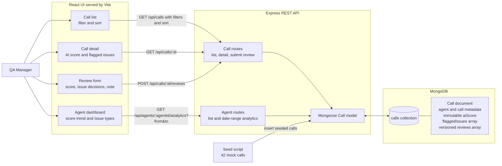
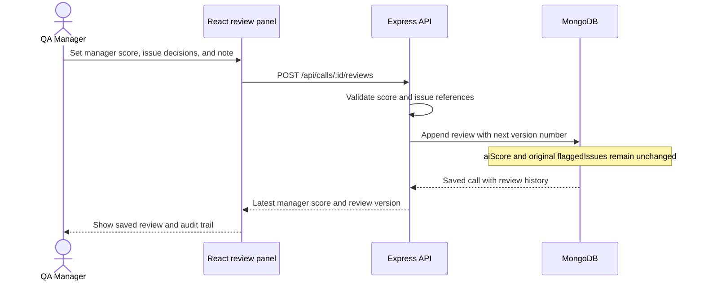

# AgentScore Architecture

## System Overview

## Manager Review Flow

## Data and API

Each call document stores the original AI score and flagged issues alongside a `reviews` array. A review contains its version, manager score, note, timestamp, and valid/invalid decisions referencing issue IDs. The latest review drives the manager score shown in the UI; earlier reviews remain available for the audit trail.

- `GET /api/calls` filters and sorts calls by agent, score, flags, date, and review score.
- `GET /api/calls/:id` returns full call details and review history.
- `POST /api/calls/:id/reviews` appends a versioned manager review without overwriting the AI score.
- `GET /api/agents` returns agents for the dashboard selector.
- `GET /api/agents/:agentId/analytics?from=...&to=...` returns average AI and manager scores, score trend, total AI-flagged issue counts, and manager-confirmed issue counts.
